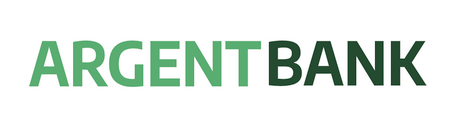

# Projet React : ArgentBank - Connexion de compte utilisateur

## Description

C'est le treizième projet de la formation de développeur d'application React de chez OpenCLassrooms.

Dans ce projet le développement se réalise en deux phases:

    Phase 1 : Authentification des utilisateurs - Création d'une application web permettant aux clients de se connecter et de gérer leurs comptes et leur profil.
    Phase 2 : Transactions - Il s’agirait de spécifier les endpoints d’API nécessaires pour une éventuelle deuxième mission une fois que nous aurons terminé la première.

Pour la phase 1, comme point de départ, il nous est fourni le HTML statique et le CSS pour la page d'accueil, la page de connexion et la page de profil.:
https://github.com/OpenClassrooms-Student-Center/Project-10-Bank-API/tree/master/designs

## Objectifs du projet

- Réaliser l'authentification à une API
- Implémenter un gestionnaire d'état dans une application React
- Intéragir avec une API
- Modéliser une API
- Maitrise de Swagger

## Outils

- Create React App
- React Routeur
- Styling : au choix CSS ou SASS
- Redux & Redux DevTools
